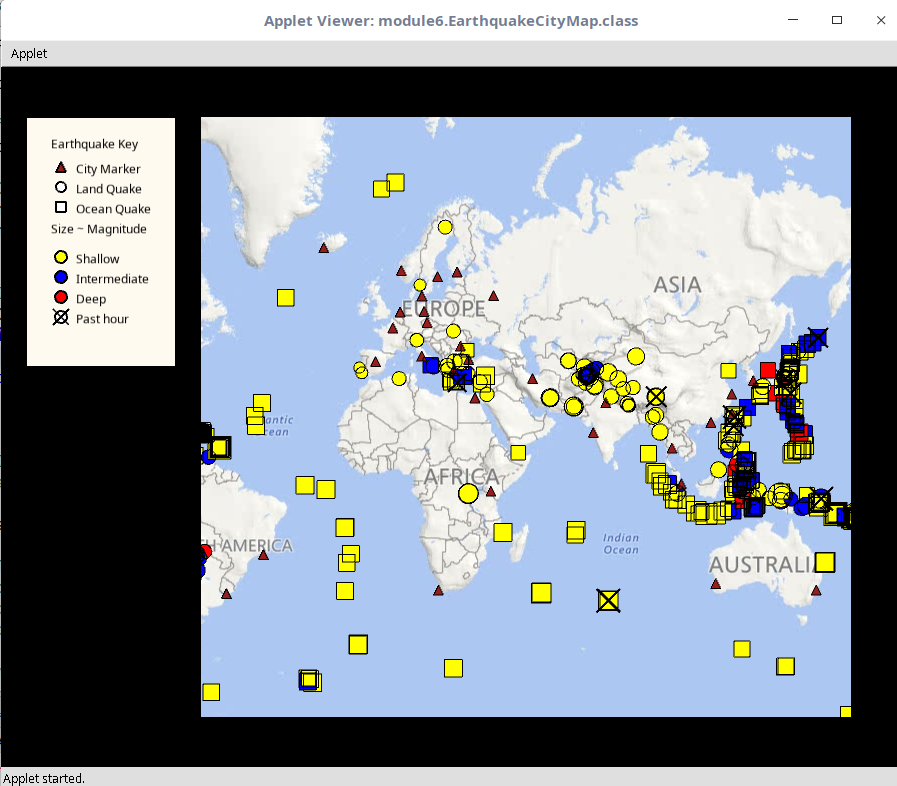

# Coursera-OOP

In this course, I implement a Graphical User Interface which showing earthquakes on the world by represent them on the google maps in java with using Unfolding Maps library.

Here is the final version of the map at the end of the project

